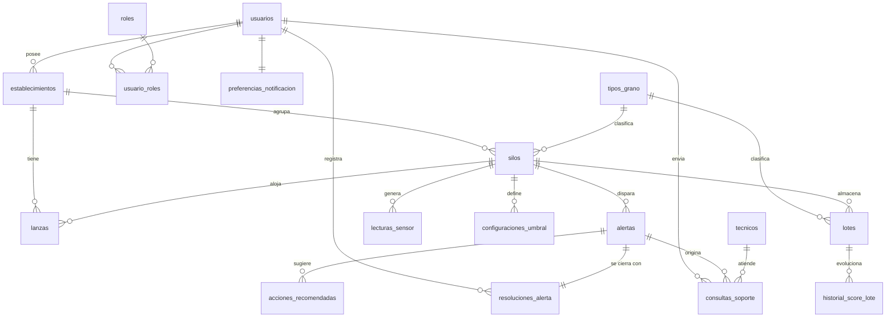

# SiloGuard — Modelo de Datos (plan de implementación)

> **⚡ Estado (2026-07-15):** del plan de este documento ya se **implementó** en el backend:
> `Umbrales` (configuraciones_umbral), `Destinatarios` + `LoteDestinatarios` (la N-N de
> compartir pasaporte, tomada de §12 extensiones), `Tecnicos`, `ConsultasSoporte` y
> `PreferenciasNotificacion` — migración `AddUmbralesPasaporteCompartidoYSoporte`.
> La base quedó en **14 tablas** (13 de dominio + auditoría) con **2 relaciones N-N**.
> No se implementó el refactor de `establecimientos`/`tipos_grano`/`lanzas` (decisión de
> alcance por deadline: migración con transformación de datos, riesgo alto).
> Ver `docs/CHECKLIST-DEFENSA.md` para la demo de cada pieza.

> Documento de **diseño** del modelo de datos del backend, derivado del alcance que el equipo
> va a construir y presentar: **`SiloGuard_definicion_producto_implementado.md`** (26 pantallas
> + Dispositivos). Reemplaza a versiones anteriores basadas en la v2 del producto.
>
> **Este archivo NO modifica la base actual.** Es la especificación de qué tablas, relaciones
> y operaciones habría que implementar. La implementación real (entidades EF, configuraciones,
> migraciones) queda para un paso posterior.
>
> **Cambios clave respecto de lo que había propuesto antes (según el doc implementado):**
> - Se elimina Resumen semanal (`resumenes_semanales`, `resumen_semanal_silo`) — descartada en el producto.
> - Se elimina el registro de destinatarios del pasaporte (`destinatarios_pasaporte`,
>   `lote_destinatarios`) — el doc solo tiene un **botón de compartir** (share sheet), sin registrar con quién.
> - Se elimina la asignación técnico↔establecimiento (`tecnico_establecimiento`) — el contacto
>   con técnico es genérico, no hay asignación por establecimiento.
> - Se **incorpora** la pantalla **Dispositivos** → tabla `lanzas` con estado (agregado del doc implementado).
> - Se **incorpora** el registro en 2 pasos → `establecimientos` como tabla propia.

---

## 1. Estado actual vs. objetivo

| | Ahora (implementado) | Objetivo (este plan) |
|---|---|---|
| Tablas de dominio | **8** (`Users`, `Roles`, `UserRoles`, `Silos`, `SensorReadings`, `Alerts`, `Lotes`, `AuditLogs`) | **17** |
| Relaciones 1–N | ~6 | **15** |
| Relaciones N–N | 1 (`UserRoles`) | **1** *(ver §6 y §12)* |
| Operaciones maestro–detalle / ABM | 1 ABM completo (Silos) | **2–3** |
| Operaciones transaccionales | 2 | **3** |
| Auditoría automática | Sí (`AuditLog` vía `SaveChangesAsync`) | Sí (ampliada) |

> **Nota de honestidad.** Este modelo se ciñe a lo que el doc implementado sustenta de verdad.
> Da **17 tablas** y **1 relación N–N**. La referencia de la consigna 3.5.1 (20 tablas, 3 N–N)
> queda por encima de este alcance. En §12 se listan **extensiones opcionales** — con respaldo
> débil en la UI — que llevarían el modelo a ~21 tablas y 3 N–N si se decide priorizar la rúbrica.

---

## 2. Tablas del modelo (17)

Cada tabla indica su origen en el producto implementado. Las que **ya existen** en el backend
están marcadas; el resto son nuevas.

### Grupo A · Usuarios y establecimiento

**1. `usuarios`** *(ya existe: `Users`)* — Productor. Registro paso 1 + perfil. P3, P4, P5, P19, P20.
`id` PK · `nombre` · `email` (único) · `password_hash` · `telefono?` · `email_verificado` (bool) · `tutorial_completado` (bool, P10) · `created_at` · `updated_at`
> *Nota:* login JWT stateless + verificación de email vía Firebase, por eso no hay tablas propias
> de tokens de sesión / verificación / reset.

**2. `roles`** *(ya existe: `Roles`)* — Productor (MVP) / Admin.
`id` PK · `nombre` (único)

**3. `usuario_roles`** *(ya existe: `UserRoles`)* — **Intermedia N–N** usuarios ↔ roles.
`usuario_id` FK · `rol_id` FK · PK compuesta (`usuario_id`, `rol_id`)

**4. `establecimientos`** *(nueva)* — Campo del productor (registro paso 2: nombre + localidad/
provincia). Agrupa silos y lanzas. P4, P19; base de la pantalla Dispositivos.
`id` PK · `usuario_id` FK → usuarios · `nombre` · `localidad?` · `provincia?` · `created_at` · `updated_at`

### Grupo B · Dispositivos y monitoreo

**5. `tipos_grano`** *(nueva)* — Catálogo: Soja / Maíz / Trigo / Girasol / Otro (P9, con custom).
`id` PK · `nombre`
> *Nota:* normaliza el campo texto `Grain` que hoy vive en `Silos`. "Otro" admite etiqueta libre.

**6. `lanzas`** *(nueva)* — Dispositivo IoT vinculado por QR + WiFi. **Pantalla Dispositivos**
lista las lanzas del establecimiento con su estado. P8, P8b, Dispositivos.
`id` PK · `establecimiento_id` FK → establecimientos · `silo_id?` FK → silos (0..1, silo donde está clavada) · `codigo_qr` (único) · `estado` (`ok`/`sin_respuesta`) · `ultima_senal_at?` · `created_at`

**7. `silos`** *(ya existe: `Silos`)* — Silo/silobolsa monitoreado. P11, P12, P17, P18.
`id` PK · `establecimiento_id` FK → establecimientos · `tipo_grano_id` FK → tipos_grano · `nombre` · `tons` · `storage` (fijo/bolsa) · `fecha_acopio?` · `status` (`ok`/`warn`/`critical`) · `last_co2` · `last_temp` · `last_hum` · `last_reading_at?` · `created_at` · `updated_at`
> *Nota:* hoy `Silos` referencia `UserId` directo y guarda `Grain`/`Acopio` como texto. El plan
> reemplaza eso por `establecimiento_id` + `tipo_grano_id` (FKs) y `fecha_acopio`.

**8. `lecturas_sensor`** *(ya existe: `SensorReadings`)* — Serie temporal CO₂/temp/humedad. P13.
`id` PK · `silo_id` FK → silos · `timestamp` · `co2` · `temp` · `hum`

**9. `configuraciones_umbral`** *(nueva)* — Umbral de alerta por silo **y por variable**
(una fila por CO₂ / temperatura / humedad → 1–N con el silo). Pantalla Umbrales. P21.
`id` PK · `silo_id` FK → silos · `variable` (`co2`/`temp`/`hum`) · `valor_maximo` · `updated_at`

### Grupo C · Alertas

**10. `alertas`** *(ya existe: `Alerts`)* — Anomalía detectada (Crítica/Advertencia/Resuelta). P14, P15.
`id` PK · `silo_id` FK → silos · `sensor` · `valor` · `umbral` · `variant` (`critical`/`warning`/`resolved`) · `titulo` · `descripcion` · `estimate?` · `status` (`active`/`resolved`) · `created_at` · `resolved_at?`

**11. `acciones_recomendadas`** *(nueva)* — Acciones sugeridas de una alerta (sección "¿Qué
hacer?" del detalle → principal + secundarias, 1–N). P15.
`id` PK · `alerta_id` FK → alertas · `orden` · `descripcion` · `tipo` (`aireacion`/`inspeccion`/`tecnico`/`otro`)

**12. `resoluciones_alerta`** *(nueva)* — Cierre de la alerta: acción tomada (Aireación/
Inspección/Técnico/Otro) + nota opcional (bottom sheet de resolución). P16.
`id` PK · `alerta_id` FK → alertas (único → 1–1) · `usuario_id` FK → usuarios · `accion` · `nota?` · `resuelta_at`
> *Nota:* hoy estos datos viven inline en `Alerts` (`ResolutionNote`, `ResolutionReason`,
> `ResolvedAt`). El plan los normaliza a tabla propia para dejar traza limpia del cierre.

### Grupo D · Pasaporte de Calidad

**13. `lotes`** *(ya existe: `Lotes`)* — Ciclo de almacenamiento con pasaporte (Iniciar/Finalizar). P23, P24.
`id` PK · `silo_id` FK → silos · `tipo_grano_id` FK → tipos_grano · `codigo` (único) · `nombre` · `tons` · `start_at` · `end_at?` · `status` (`monitoring`/`finalized`) · `score` · `alerts_resolved` · `avg_co2` · `avg_temp` · `avg_hum` · `created_at` · `updated_at`

**14. `historial_score_lote`** *(nueva)* — Snapshots del score para el **gráfico de evolución**
del pasaporte (P24, "score histórico, gráfico de evolución"). 1–N con el lote.
`id` PK · `lote_id` FK → lotes · `fecha` · `score` · `avg_co2` · `avg_temp` · `avg_hum`

### Grupo E · Soporte y notificaciones

**15. `tecnicos`** *(nueva)* — Técnico/agrónomo de contacto. P25.
`id` PK · `nombre` · `telefono` · `horario` · `activo` (bool)

**16. `consultas_soporte`** *(nueva)* — Consulta enviada a un técnico desde una alerta,
fuera de horario de atención (formulario de P25).
`id` PK · `alerta_id` FK → alertas · `tecnico_id` FK → tecnicos · `usuario_id` FK → usuarios · `mensaje` · `estado` (`enviada`/`respondida`) · `created_at`

**17. `preferencias_notificacion`** *(nueva)* — Preferencias por usuario: advertencias,
silencio nocturno con rango horario (críticas siempre on). Pantalla Notificaciones. P22. 1–1 con usuario.
`id` PK · `usuario_id` FK → usuarios (único) · `advertencias` (bool) · `silencio_nocturno` (bool) · `silencio_desde?` · `silencio_hasta?`

### Grupo F · Auditoría

**Aud. `auditoria`** *(ya existe: `AuditLogs`)* — Registro de trazabilidad (§9). Es la tabla de
auditoría requerida; no se contabiliza dentro de las 17 de dominio.
`id` PK · `entity_name` · `entity_id` · `action` (`Added`/`Modified`/`Deleted`) · `usuario_id?` · `timestamp` · `details?`

---

## 3. Diagrama entidad–relación

---

## 4. Relaciones 1–N (15)

| # | Lado 1 | Lado N | FK |
|---|---|---|---|
| 1 | `usuarios` | `establecimientos` | `establecimientos.usuario_id` |
| 2 | `usuarios` | `consultas_soporte` | `consultas_soporte.usuario_id` |
| 3 | `establecimientos` | `silos` | `silos.establecimiento_id` |
| 4 | `establecimientos` | `lanzas` | `lanzas.establecimiento_id` |
| 5 | `tipos_grano` | `silos` | `silos.tipo_grano_id` |
| 6 | `tipos_grano` | `lotes` | `lotes.tipo_grano_id` |
| 7 | `silos` | `lanzas` | `lanzas.silo_id` (0..1) |
| 8 | `silos` | `lecturas_sensor` | `lecturas_sensor.silo_id` |
| 9 | `silos` | `configuraciones_umbral` | `configuraciones_umbral.silo_id` |
| 10 | `silos` | `alertas` | `alertas.silo_id` |
| 11 | `silos` | `lotes` | `lotes.silo_id` |
| 12 | `alertas` | `acciones_recomendadas` | `acciones_recomendadas.alerta_id` |
| 13 | `alertas` | `consultas_soporte` | `consultas_soporte.alerta_id` |
| 14 | `tecnicos` | `consultas_soporte` | `consultas_soporte.tecnico_id` |
| 15 | `lotes` | `historial_score_lote` | `historial_score_lote.lote_id` |

*(1–1: `alertas`→`resoluciones_alerta`, `usuarios`→`preferencias_notificacion`; FK única.)*

---

## 6. Relaciones N–N (1)

| # | Entidad A | Entidad B | Tabla intermedia | Justificación en el producto |
|---|---|---|---|---|
| 1 | `usuarios` | `roles` | **`usuario_roles`** | Roles de usuario (Productor / Admin) |

> El doc implementado no sustenta más relaciones N–N. Ver **§12** para las opciones que las
> agregarían (con respaldo débil en la UI actual).

---

## 7. Operaciones maestro–detalle / ABM

Cada una corre dentro de **una transacción con rollback**.

### ABM-1 · Silo (cabecera) + detalles — P9, P17, P18  *(completo: Alta / Baja / Modificación)*
- **Maestro:** `silos`
- **Detalles:** `lanzas` (dispositivo vinculado) + `configuraciones_umbral` (3 filas por defecto) + `lecturas_sensor` (lectura inicial).
- **Reglas:** alta crea silo + detalles en transacción; si falla un detalle se revierte el silo.
  Baja elimina el silo y sus detalles en cascada. *(Ya existe una versión reducida: silo + lectura inicial.)*

### ABM-2 · Umbrales del silo (cabecera silo + detalle umbrales) — P21  *(Alta / Modificación / Restaurar)*
- **Maestro:** `silos`
- **Detalles:** `configuraciones_umbral` (3 filas: CO₂ / temp / humedad).
- **Reglas:** "Guardar" reemplaza las 3 filas en transacción; "Restaurar valores recomendados"
  las regenera desde el tipo de grano. Modificar detalles = caso maestro-detalle de la rúbrica.

### MD-3 · Iniciar / Finalizar lote (pasaporte) — P24, Flow 8
- **Maestro:** `lotes`
- **Detalles:** `historial_score_lote` (snapshots del score).
- **Reglas:** Iniciar crea el lote + primer snapshot (409 si el silo ya tiene uno en `monitoring`).
  Finalizar consolida el pasaporte (ver TX-1). *(No hay baja de lote en el doc implementado.)*

---

## 8. Operaciones transaccionales

### TX-1 · Finalizar lote — *cálculo / consolidación* — P24
Recalcula `score` + promedios sobre las `lecturas_sensor` del período `[start_at, end_at]`,
cambia `status` `monitoring → finalized`, escribe el snapshot final en `historial_score_lote`
y setea `end_at`. Rollback si algo falla. *(Ya implementado en `LoteService`.)*

### TX-2 · Marcar alerta como resuelta — *cambio de estado + registros derivados* — P16
Valida que la alerta esté `active`; cambia `status → resolved`/`variant → resolved`; crea
`resoluciones_alerta`; incrementa `alerts_resolved` del lote activo del silo; recalcula
`silos.status`. Todo en una transacción.

### TX-3 · Alta de silo — *maestro-detalle con rollback* — P9, P17
Silo + lectura inicial + umbrales por defecto en una transacción; si la lectura viola un
check constraint de rango, el rollback deshace también el silo. *(Ya implementado, versión reducida.)*

---

## 9. Mecanismos de auditoría

**Tabla:** `auditoria` (hoy `AuditLogs`): `entity_name`, `entity_id`, `action`, `usuario_id`,
`timestamp`, `details`.

**Mecanismo automático:** interceptar `SaveChangesAsync` y, por cada entidad relevante en
estado `Added`/`Modified`/`Deleted`, generar una fila de auditoría con usuario + timestamp.
*(Ya implementado para `Silo`, `Alert`, `Lote`.)* **Ampliación:** auditar también
`establecimientos`, `configuraciones_umbral`, `resoluciones_alerta`, `usuario_roles`.

---

## 10. Trazabilidad tabla ↔ pantalla (doc implementado)

| Tabla | Pantalla / funcionalidad |
|---|---|
| `usuarios` | Login/registro/perfil (P3, P4, P19, P20) |
| `roles`, `usuario_roles` | Roles (Productor/Admin) |
| `establecimientos` | Registro paso 2 + Dispositivos (P4, P19) |
| `lanzas` | Vincular lanza + pantalla Dispositivos (P8, P8b, Extra) |
| `tipos_grano` | Tipo de grano en asignación de silo (P9) |
| `silos` | Dashboard y gestión de silos (P11, P12, P17, P18) |
| `lecturas_sensor` | Historial de sensores (P13) |
| `configuraciones_umbral` | Configuración de umbrales (P21) |
| `alertas`, `acciones_recomendadas`, `resoluciones_alerta` | Sistema de alertas (P14–P16) |
| `lotes`, `historial_score_lote` | Pasaporte de Calidad (P23, P24) |
| `tecnicos`, `consultas_soporte` | Contacto con técnico (P25) |
| `preferencias_notificacion` | Notificaciones (P22) |
| `auditoria` | Trazabilidad |

---

## 11. Notas de implementación (para cuando se ejecute)

- **No ejecutar todavía.** Implementación en un paso aparte (entidades, `IEntityTypeConfiguration`,
  migraciones EF, `DbContext`, seeder).
- **Refactor de `silos`:** cambia `UserId`/`Grain`/`Acopio` (texto) por `establecimiento_id` +
  `tipo_grano_id` (FKs) + `fecha_acopio`. Migración de datos dedicada.
- **Orden sugerido de migraciones:** (1) `tipos_grano` + `establecimientos` + refactor `silos`;
  (2) `lanzas` + `configuraciones_umbral`; (3) `acciones_recomendadas` + `resoluciones_alerta`;
  (4) `historial_score_lote`; (5) `tecnicos` + `consultas_soporte` + `preferencias_notificacion`.
- **Convenciones:** timestamps en `SaveChangesAsync`; auditoría automática extendida (§9).

---

## 12. Extensiones opcionales (para acercarse a la referencia de la rúbrica)

> Estas tablas **no** están sustentadas con firmeza por el doc implementado. Solo tienen
> sentido si el equipo decide priorizar los números de referencia de la consigna 3.5.1
> (20 tablas, 3 N–N) por encima del alcance estricto de lo que se va a programar. **Decisión del equipo.**

| Extensión | Tablas | Efecto | Respaldo en la UI |
|---|---|---|---|
| Registrar con quién se comparte cada pasaporte | `destinatarios_pasaporte` + `lote_destinatarios` (**N–N**) | +2 tablas, +1 N–N | Débil: hoy solo hay "botón compartir" (share sheet), sin registrar destinatario |
| Asignar técnicos a establecimientos | `tecnico_establecimiento` (**N–N**) | +1 tabla, +1 N–N | Débil: el contacto con técnico es genérico |
| Historial de notificaciones push enviadas | `notificaciones` | +1 tabla, +1 relación 1–N | Débil: no hay pantalla que liste las push recibidas |

Con las tres extensiones: **17 → 21 tablas** y **1 → 3 relaciones N–N**, alineado con la referencia
de la rúbrica. Sin ellas, el modelo refleja exactamente lo que describe el doc implementado.

---

*Plan derivado de `SiloGuard_definicion_producto_implementado.md`. 17 tablas de dominio ·
15 relaciones 1–N · 1 N–N · 2–3 ABM/maestro-detalle · 3 transaccionales · 1 tabla de auditoría.*
