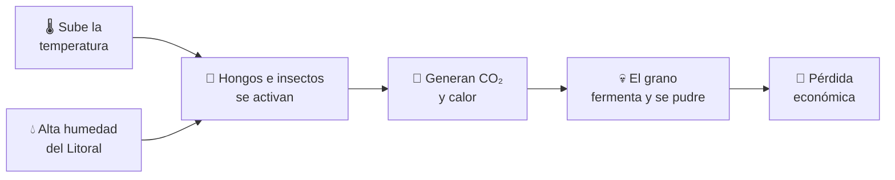
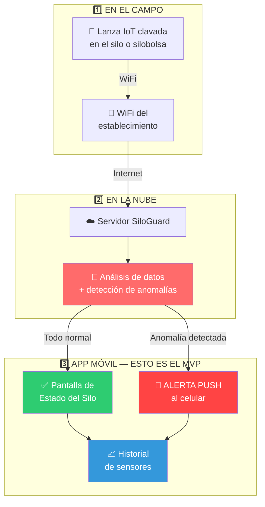
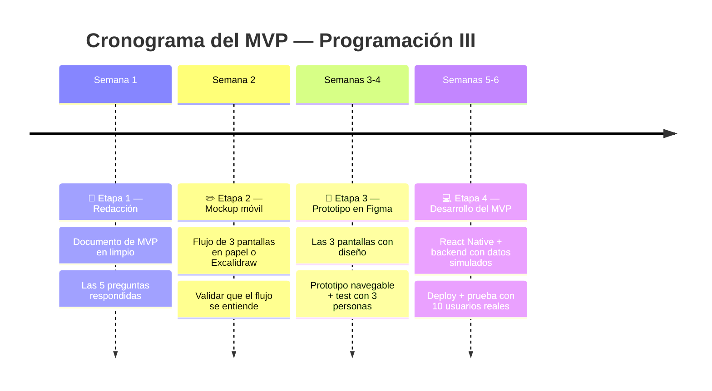

# 🌾 SiloGuard — Presentación del Proyecto
### Alerta temprana de deterioro de granos para productores PyME del Litoral

**Materia**: Programación III
**Tipo de entregable**: App móvil (MVP)
**Fecha**: 2026

> ⚠️ **Nota (copiado sin editar desde el documento original de planificación):** la sección 8
> "Arquitectura Técnica" de más abajo describe el stack que se había planeado en su momento
> (FastAPI + PostgreSQL/TimescaleDB). El proyecto que finalmente se construyó y está en este
> repo usa **.NET 10 + PostgreSQL** (ver `backend/README.md`), no FastAPI/TimescaleDB. Falta
> actualizar esa sección antes de usar este documento tal cual para la presentación final.

---

## 📌 ¿Qué es SiloGuard en una oración?

> **SiloGuard es una app móvil que, conectada a una lanza con sensores clavada en el silo o silobolsa, le avisa al productor en el celular al menos 48 horas ANTES de que el grano empiece a pudrirse.**

> ⚠️ **Importante para el alcance del TP:** Lo que se construye en esta materia es **la aplicación móvil**. La lanza IoT es parte del sistema completo de SiloGuard pero queda fuera del alcance del MVP de Programación III. Lo que entregamos es la app que el productor abre todos los días.

---

## 1. El Problema que Resolvemos

### La realidad del campo argentino

Argentina produce alrededor de **135 millones de toneladas de granos por año**, y más del **50% de esa cosecha se guarda en silobolsas** porque la capacidad de silos fijos es insuficiente. Esto significa que se almacenan **entre 50 y 70 millones de toneladas en silobolsa por temporada**.

El Litoral (Santa Fe, Entre Ríos, Chaco, Corrientes) es la zona de **mayor riesgo** porque combina calor extremo con humedad relativa sostenida por encima del 80% durante los meses de mayor calor.

**¿Qué pasa hoy?** El productor PyME guarda su cosecha y básicamente *reza*. Revisa el silo una o dos veces por semana —si llega a hacerlo— y no tiene forma de saber qué pasa adentro hasta que abre el silo y encuentra grano podrido.

### Los números del problema (validados por INTA)

```
🌾  Argentina almacena entre 50 y 70 MILLONES de toneladas en silobolsa por año
💀  Según INTA Balcarce: 5-8% de las bolsas sufren problemas que comprometen el grano
💵  Las pérdidas pueden llegar a USD 25 por metro lineal de soja afectada
🌡️  Meses más peligrosos: Noviembre a Marzo (calor + humedad)
⏱️  Entre el inicio de fermentación y la pérdida irreversible: 48 a 72 horas
🧑‍🌾  ~40.000 productores PyME en el Litoral sin solución digital accesible
```

### ¿Por qué se pudre el grano?



**El problema clave**: Este proceso empieza **invisible**. Cuando el productor lo nota a simple vista, ya perdió entre el 20% y el 40% del lote. Es como un incendio que empieza sin humo.

> 💡 **Validación científica:** El INTA Balcarce, a través del especialista Leandro Cardoso (poscosecha), recomienda explícitamente **medir CO₂** como herramienta para anticiparse a los problemas de almacenamiento "antes de que se manifiesten como pérdidas". Cuando los granos se descomponen por hongos, el CO₂ dentro del silo o silobolsa puede superar el 5% (vs. niveles normales muy inferiores). Eso convierte al CO₂ en el indicador más temprano y confiable de deterioro.

---

## 2. El Usuario — ¿Para Quién es SiloGuard?

### Carlos, 48 años — Productor PyME en Rafaela, Santa Fe

| Aspecto | Detalle |
|---|---|
| **Actividad** | Trabaja 550 hectáreas (campo propio + arrendado) |
| **Almacenamiento** | 200-400 tn de soja en silo metálico + 80-120 tn de maíz en silobolsa, entre noviembre y marzo |
| **Equipo** | No tiene técnicos permanentes. Trabaja con un agrónomo externo que lo visita cada 2 semanas |
| **Tecnología que usa** | WhatsApp todos los días. Apps simples del clima. Sin formación informática. |
| **Frustración real** | En la campaña 2024-2025 perdió ~15 toneladas de soja que descubrió fermentadas al preparar el lote para venta → USD 5.200 perdidos |
| **Lo que rechaza** | Soluciones que requieran antenas, técnicos especializados, o que parezcan pensadas para productores grandes |

> Carlos no quiere "transformarse digitalmente". Quiere abrir el celular en el desayuno, ver un color verde y seguir con su día. Y quiere que cuando algo esté mal, el celular se lo grite.

---

## 3. La Solución

**SiloGuard permite a productores agropecuarios PyME del Litoral recibir una alerta en el celular al menos 48 horas antes de que el grano empiece a deteriorarse, sin tener que abrir el silo ni depender de inspecciones que llegan siempre demasiado tarde.**

### El sistema completo (visión)



### ¿Qué mide la lanza? (componente externo al MVP)

| Variable | ¿Por qué importa? |
|---|---|
| 🫧 **CO₂** | Cuando el grano fermenta, las bacterias y hongos liberan CO₂. **Es la señal más temprana y más confiable de deterioro** (validado por INTA). |
| 🌡️ **Temperatura interna** | Si sube sin razón externa, hay actividad biológica en curso. |
| 💧 **Humedad del grano** | Granos con más del 14% de humedad son bombas de tiempo en el Litoral. |

---

## 4. El MVP — Las 3 Pantallas

El MVP de SiloGuard tiene **una sola hipótesis a probar**:

> **¿El productor actúa sobre una alerta temprana con suficiente anticipación para salvar el grano?**

Todo lo que no sirva para probar esto queda afuera. El MVP son **3 pantallas** del flujo principal.

### 📱 Pantalla 1 — Estado del Silo (la pantalla del día a día)

Es la pantalla que Carlos abre en el desayuno. Le muestra de un vistazo si su silo está bien.

```
┌─────────────────────────────────────┐
│  🌾 SiloGuard                  ⚙️   │
│  ─────────────────────────────────  │
│                                     │
│         Silo Principal              │
│                                     │
│         ┌─────────┐                 │
│         │   96    │ 🟢              │
│         │  /100   │                 │
│         └─────────┘                 │
│        Estado: NORMAL               │
│                                     │
│  ─────────────────────────────────  │
│  🫧 CO₂           180 ppm   ✅       │
│  🌡️ Temperatura   24°C      ✅      │
│  💧 Humedad       12.8%     ✅      │
│  ─────────────────────────────────  │
│  Última lectura: hace 12 minutos    │
│                                     │
│  [VER HISTORIAL]                    │
└─────────────────────────────────────┘
```

**¿Por qué esta pantalla está en el MVP?** Porque construye el hábito de consulta. Carlos abre la app todos los días y ve verde → confía. Cuando un día vea rojo, va a creerle.

### 📱 Pantalla 2 — Alerta y Acción Recomendada (el corazón del MVP)

Cuando los sensores detectan un patrón compatible con fermentación, Carlos recibe una **notificación push** en el celular. Al abrirla, ve esto:

```
┌─────────────────────────────────────┐
│  🚨 ALERTA CRÍTICA                  │
│  ─────────────────────────────────  │
│                                     │
│  Silo Principal                     │
│  Posible inicio de fermentación     │
│  detectado en zona noreste          │
│                                     │
│  ⏱️ Tiempo estimado antes de        │
│      pérdida irreversible:          │
│      48 a 72 horas                  │
│                                     │
│  📊 Lo que está pasando:            │
│  • CO₂ subió de 180 a 340 ppm       │
│  • Temperatura +4°C en 12 hs         │
│  • Humedad llegó al 14.1%            │
│                                     │
│  📋 Acción recomendada:             │
│  → Encender aireación cuanto antes  │
│  → Revisar zona noreste del silo    │
│                                     │
│  [VER DETALLE]  [VER HISTORIAL]     │
└─────────────────────────────────────┘
```

**¿Por qué esta pantalla está en el MVP?** Es el núcleo de la hipótesis. Si Carlos no entiende la alerta o no sabe qué hacer, no actúa. Si el lenguaje es técnico o vago, no actúa. La alerta tiene que ser **clara, urgente y con una acción concreta**.

### 📱 Pantalla 3 — Historial de Sensores (la confirmación)

Después de que Carlos enciende la aireación, necesita ver que los valores están bajando. Si no, actuó a ciegas.

```
┌─────────────────────────────────────┐
│  📈 Historial — Últimas 72 hs       │
│  ─────────────────────────────────  │
│                                     │
│  CO₂ (ppm)                          │
│   400 ┤        ╱╲                   │
│   300 ┤      ╱   ╲___                │
│   200 ┤────╯       ╲___              │
│   100 ┤                              │
│       └────────────────────────      │
│         hace 72hs    ahora          │
│                                     │
│  Temperatura (°C)                   │
│    30 ┤      ╱╲                     │
│    25 ┤────╯  ╲___                  │
│    20 ┤                              │
│       └────────────────────────      │
│                                     │
│  ✅ Tendencia: en mejora            │
│  Tu acción está funcionando         │
└─────────────────────────────────────┘
```

**¿Por qué esta pantalla está en el MVP?** Sin esta pantalla, Carlos no tiene forma de confirmar que su intervención sirvió. Y sin esa confirmación, no desarrolla confianza en el sistema. La próxima vez que reciba una alerta, va a dudar.

---

## 5. ¿Por qué es Mínimo?

### ✅ Lo que SÍ está en el MVP

1. Pantalla de **Estado del Silo** (score + valores actuales + indicador visual)
2. Pantalla de **Alerta** (notificación push + descripción + acción recomendada)
3. Pantalla de **Historial** (gráficos de últimas 48-72 hs)

### ❌ Lo que NO está en el MVP (queda explícitamente afuera)

- **Onboarding y vinculación del dispositivo** (registro, escaneo QR, configuración WiFi del silo)
- **Gestión multi-silo** (vista resumen de varios silos en simultáneo)
- **Configuración personalizada de alertas** (cambiar umbrales, silenciar horarios)
- **Pasaporte de Calidad** (certificado digital del lote con QR para bancos/compradores)
- **Historial completo de alertas de la campaña**
- **Resumen semanal automático** (notificación de los lunes)
- **Pronóstico meteorológico integrado**
- **Contacto directo con técnico desde la app**
- **Panel web / dashboard de escritorio** → SiloGuard MVP es **solo mobile**

> 🎯 Cada una de estas funcionalidades es una buena idea. **Pero ninguna prueba la hipótesis del MVP.** Van al backlog. La versión 1.0 es lo que está arriba; el resto es 1.1.

---

## 6. ¿Cómo Sabemos que Funciona?

### Métrica de éxito (basada en comportamiento, no en opinión)

> **El 70% de los productores piloto que reciben una alerta de fermentación potencial ejecutan al menos una acción de intervención —encender la aireación, contactar un técnico o realizar una inspección física— dentro de las 12 horas posteriores a la notificación, sin que nadie del equipo los instruya para hacerlo.**

| ❌ Lo que NO mide | ✅ Lo que SÍ mide |
|---|---|
| Si a Carlos le gustó la app | Si Carlos **actuó** después de la alerta |
| Si recomendaría SiloGuard | Si actuó **a tiempo** (dentro de 12 hs) |
| Cuántas estrellas le pone | Si actuó **sin que le expliquemos** |

**Por qué esta métrica:** Una alerta sin acción no salva grano. El valor de SiloGuard no está en mostrar números bonitos en una pantalla; está en cambiar la conducta del productor a tiempo. Esa conducta es lo único que se traduce en grano salvado, y por lo tanto en valor económico real.

---

## 7. ¿Por qué Mobile y Por qué Ahora?

### ¿Por qué solo mobile?

Carlos no abre la laptop para ver el silo. Carlos abre el celular. Punto.

- WhatsApp y el clima son las dos apps que ya usa todos los días → el celular es donde vive
- Las alertas tienen que llegar por **notificación push** porque la fermentación no espera al horario de oficina
- Las inspecciones físicas se hacen *en el campo*, no frente a una computadora → la app tiene que estar donde está el productor

### ¿Por qué este enfoque y no otro?

Ya existen sistemas de monitoreo de silos en el mercado (INTA Co2ntrol, Silcheck, Wiagro, entre otros). Algunos son portátiles que requieren ir físicamente al silo a tomar muestras. Otros son lanzas con sensores pero pensados para grandes acopios.

**Lo que SiloGuard hace distinto:**

| Diferenciador | SiloGuard | Otros sistemas |
|---|---|---|
| **Dueño del problema** | Productor PyME del Litoral | Grandes acopios o ingenieros agrónomos |
| **Frecuencia de monitoreo** | Continuo (lecturas cada 10-30 min) | Manual cada 21-45 días |
| **Cuándo se entera el productor** | Push automático en el celular | Hay que ir físicamente o esperar el reporte |
| **Foco del producto** | La app, la alerta clara y la acción | El hardware, los datos crudos |
| **Diseñado para** | Humedad sostenida >80% del Litoral | Condiciones generales pampeanas |

---

## 8. Arquitectura Técnica (para el alcance del MVP)

### Stack tecnológico del MVP móvil

| Capa | Tecnología | Por qué |
|---|---|---|
| **Frontend mobile** | React Native + Expo | Una sola codebase para Android + iOS. Setup rápido. JavaScript ya conocido. |
| **Backend / API** | FastAPI (Python) | Rápido de desarrollar, tipado, excelente integración con análisis de datos. |
| **Base de datos** | PostgreSQL + TimescaleDB | TimescaleDB está optimizada para series temporales (lecturas cada 10-30 min durante meses). |
| **Notificaciones push** | Expo Push / Firebase Cloud Messaging | Standard de la industria, gratuito hasta volúmenes altos. |
| **Hosting / Deploy** | Railway o Vercel | Deploy en minutos, sin manejo de infraestructura. |

### El componente IoT (queda fuera del MVP de Programación III)

Para que la app reciba datos reales, en el futuro la lanza IoT usará:

- **ESP32-S3** como microcontrolador (WiFi integrado, bajo consumo)
- Sensor de **CO₂ MH-Z19C** (NDIR, preciso y estable a largo plazo)
- Sensor de temperatura y humedad **SHT31**
- Carcasa **IP67** + conformal coating + membrana Gore-Tex para sobrevivir a la humedad sostenida del Litoral
- Acero inoxidable 304 para resistir corrosión del grano fermentado

> Durante el MVP, los datos de los sensores se **simulan** en el backend para poder probar las 3 pantallas y la lógica de alertas sin depender del hardware físico.

---

## 9. Roadmap del TP (Cronograma sugerido — 6 semanas)



### Criterio de "terminado" para el MVP

- [ ] Las 3 pantallas funcionan de punta a punta
- [ ] La app está desplegada en un ambiente accesible (no localhost)
- [ ] Las notificaciones push llegan al celular
- [ ] Los datos del backend (simulados) alimentan las pantallas
- [ ] Se midió la métrica del 70% con al menos 10 usuarios reales
- [ ] Las funcionalidades que quedan fuera están en el backlog

---

## 10. Materias de la Carrera que se Aplican

| Materia | Cómo se aplica al MVP |
|---|---|
| **Programación III** | App móvil con React Native, manejo de estado, navegación entre pantallas |
| **Base de Datos** | Modelado de datos relacionales (usuarios, silos, lecturas), series temporales con TimescaleDB |
| **Redes** | Protocolo HTTPS entre app y backend, futuras integraciones MQTT con la lanza IoT |
| **Sistemas Operativos** | Notificaciones push, manejo de procesos en el servidor backend |
| **Ingeniería de Software** | Metodología de desarrollo MVP, testing, control de versiones, CI/CD |

---

## 11. Próximos Pasos Concretos

- [ ] Cerrar el documento de Etapa 1 (Redacción del MVP) — **ya disponible en `SiloGuard_MVP.md`**
- [ ] Dibujar el mockup de las 3 pantallas en papel o Excalidraw (Etapa 2)
- [ ] Setup del proyecto en Figma con tamaño iPhone 14/15 (390 × 844px) y sistema de diseño mínimo
- [ ] Definir los 5 productores piloto a contactar para test del prototipo
- [ ] Contactar INTA Rafaela para validación técnica del enfoque

---

## Resumen Final

```
┌─────────────────────────────────────────────────────────────┐
│                                                             │
│   🌾 SILOGUARD en 30 segundos:                              │
│                                                             │
│   ❓ Problema: 5-8% del grano almacenado en silobolsa en    │
│      Argentina se deteriora. En el Litoral, peor: humedad   │
│      sostenida >80% en verano + 40.000 productores PyME     │
│      sin solución digital accesible.                        │
│                                                             │
│   💡 Solución: App móvil + lanza IoT que detecta            │
│      fermentación 48-72 horas ANTES de que el grano se      │
│      pudra. Alerta push con acción concreta.                │
│                                                             │
│   📱 El MVP: 3 pantallas — Estado del Silo, Alerta y        │
│      Historial. Solo móvil. Datos simulados durante el TP.  │
│                                                             │
│   👨‍🌾 Usuario: Carlos, 48 años, Rafaela, productor PyME.   │
│      No quiere transformarse digitalmente. Quiere que       │
│      el celular le avise cuando algo está mal.              │
│                                                             │
│   📊 Métrica: 70% de los productores actúan dentro de       │
│      12 hs de recibida la alerta, sin instrucciones.        │
│                                                             │
│   🎯 Validación: INTA recomienda explícitamente medir CO₂   │
│      como indicador más temprano de deterioro.              │
│                                                             │
└─────────────────────────────────────────────────────────────┘
```

---

## Fuentes y referencias

- INTA Balcarce — Grupo de Poscosecha (Leandro Cardoso, Ricardo Bartosik)
- Sistema Co2ntrol (INTA + Ingeniería Electrónica Argentina, Rosario)
- "Más del 40% de la producción nacional se conserva en silobolsas" — Argentina.gob.ar
- "Monitoreo inteligente para preservar la calidad de los granos" — Revista Chacra / Infobae, 2025
- Documento interno: `SiloGuard_MVP.md` — Especificación formal del MVP

---

*SiloGuard — Presentación del Proyecto | Programación III | 2026*
